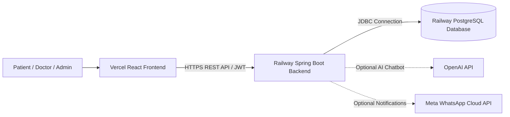

# Railway Deployment Guide: Spring Boot Backend & Cloud PostgreSQL

This guide provides step-by-step instructions for deploying the **Spring Boot Backend** of the Healthcare Appointment Management System on [Railway](https://railway.app), provisioning a cloud **PostgreSQL database**, and linking it with your **React frontend on Vercel**.

---

## 1. Required Railway Services

Your Railway project will contain two interconnected services:
1. **PostgreSQL Database Service** (`PostgreSQL` / `Postgres`): Cloud-managed PostgreSQL relational database instance.
2. **Spring Boot Backend Service** (`healthcare-backend`): Containerized Java 21 Spring Boot REST API.



---

## 2. Environment Variables Reference

Configure these environment variables in your **Spring Boot Backend** service on Railway under **Variables**:

| Environment Variable | Required | Default / Format | Description |
|---|---|---|---|
| `PORT` | Auto | *Assigned by Railway* | The HTTP port the backend binds to. Defaults to `8080` locally. |
| `DB_HOST` | **Yes** | `${{Postgres.PGHOST}}` or Hostname | Private or public PostgreSQL hostname from Railway. |
| `DB_PORT` | **Yes** | `${{Postgres.PGPORT}}` or `5432` | PostgreSQL port number. |
| `DB_NAME` | **Yes** | `${{Postgres.PGDATABASE}}` or `railway` | Database name. |
| `DB_USERNAME` | **Yes** | `${{Postgres.PGUSER}}` or `postgres` | Database username. |
| `DB_PASSWORD` | **Yes** | `${{Postgres.PGPASSWORD}}` | Database password. |
| `JWT_SECRET` | **Yes** | *256-bit Base64 String* | Secret key for signing and validating JWT tokens. |
| `JWT_EXPIRATION` | No | `86400000` (24 hours) | Token lifespan in milliseconds. |
| `FRONTEND_URL` | **Yes** | `https://your-app.vercel.app` | Allowed CORS frontend URL (e.g. your Vercel deployment URL). |
| `AI_API_KEY` | Optional | `""` (Empty string) | OpenAI/compatible API key for chatbot recommendations. |
| `AI_API_URL` | Optional | `https://api.openai.com/v1/chat/completions` | AI endpoint URL. |
| `AI_MODEL` | Optional | `gpt-4o-mini` | AI completion model name. |
| `WHATSAPP_API_URL` | Optional | `https://graph.facebook.com/v19.0` | Meta Graph API endpoint. |
| `WHATSAPP_ACCESS_TOKEN` | Optional | `""` | Permanent system user token for WhatsApp Business API. |
| `WHATSAPP_PHONE_NUMBER_ID` | Optional | `""` | WhatsApp Business Account phone number ID. |
| `FOLLOWUP_REMINDER_DAYS_BEFORE` | Optional | `1` | Advance window in days for follow-up reminders. |

> [!NOTE]
> When using Railway Reference Variables (e.g. `${{Postgres.PGHOST}}`), Railway automatically injects and syncs credentials from your PostgreSQL service directly to the backend service.

---

## 3. Step-by-Step Deployment Instructions

### Step 1: Create a Railway Project & Provision PostgreSQL
1. Log in to your [Railway Dashboard](https://railway.app/dashboard).
2. Click **New Project** -> **Provision PostgreSQL**.
3. Railway will create a dedicated `PostgreSQL` database service within a few seconds.

---

### Step 2: Obtain PostgreSQL Credentials from Railway
1. Click on the newly created **PostgreSQL** card in your Railway canvas.
2. Navigate to the **Variables** tab or **Connect** tab.
3. You will see:
   - `PGHOST` (e.g., `postgres.railway.internal` or `roundhouse.proxy.rlwy.net`)
   - `PGPORT` (e.g., `5432` or a random proxy port)
   - `PGDATABASE` (usually `railway`)
   - `PGUSER` (usually `postgres`)
   - `PGPASSWORD` (generated secure password)

---

### Step 3: Deploy the Spring Boot Backend Service
1. In the same Railway project canvas, click **+ New** (or **Add a Service**).
2. Select **GitHub Repo** and choose your repository: `Healthcare-Appointment-Management-System`.
3. Railway will auto-detect Java 21 via `pom.xml` and `system.properties`.

#### Railway Build & Start Configuration:
- **Build Command**: Automatically handled by Railway Nixpacks:
  ```bash
  ./mvnw clean package -DskipTests
  ```
- **Start Command**: Automatically detected by Railway:
  ```bash
  java -Dserver.port=$PORT -jar target/healthcare-appointment-management-system-0.0.1-SNAPSHOT.jar
  ```
- **Root Directory**: Leave as `/` (repository root).

---

### Step 4: Configure Backend Environment Variables
1. Click on the **Spring Boot backend** service card.
2. Go to the **Variables** tab.
3. Add the following variables:

```env
DB_HOST=${{Postgres.PGHOST}}
DB_PORT=${{Postgres.PGPORT}}
DB_NAME=${{Postgres.PGDATABASE}}
DB_USERNAME=${{Postgres.PGUSER}}
DB_PASSWORD=${{Postgres.PGPASSWORD}}
JWT_SECRET=<Generate a 256-bit Base64 string>
JWT_EXPIRATION=86400000
FRONTEND_URL=https://<your-frontend>.vercel.app
```

> [!TIP]
> If your database service is named `PostgreSQL` in Railway rather than `Postgres`, use `${{PostgreSQL.PGHOST}}`, etc.

#### How to Generate a Secure `JWT_SECRET`:
Run this in your terminal to generate a compliant 256-bit Base64 key:
```bash
openssl rand -base64 32
```
Copy the output and paste it as the `JWT_SECRET` value in Railway.

4. Click **Deploy** to trigger a redeployment with the new environment variables.

---

### Step 5: Generate the Backend Public Domain
1. In the backend service, go to **Settings** -> **Networking** -> **Public Networking**.
2. Click **Generate Domain** (or set a custom domain).
3. Railway will assign a URL, for example:
   ```
   https://healthcare-appointment-management-production.up.railway.app
   ```
4. Test the health of the backend by opening:
   ```
   https://<your-backend-domain>/swagger-ui/index.html
   ```
   or
   ```
   https://<your-backend-domain>/api-docs
   ```

---

### Step 6: Connect the Vercel Frontend to the Railway Backend
1. Open your [Vercel Dashboard](https://vercel.com/dashboard) and select your frontend project (`careportal` / `reactapp`).
2. Navigate to **Settings** -> **Environment Variables**.
3. Add or update the variable:
   - **Key**: `REACT_APP_API_URL`
   - **Value**: `https://<your-backend-domain>` *(do NOT include a trailing slash, e.g. `https://healthcare-backend.up.railway.app`)*
4. Make sure the variable is enabled for **Production**, **Preview**, and **Development**.
5. Go to **Deployments**, click **Redeploy** on the latest deployment so React bakes the new `REACT_APP_API_URL` into the production build.

---

## 4. Verification & Testing Checklist

- [ ] **Database Connection**: Check Railway backend deploy logs for `HikariPool-1 - Start completed` and automatic Hibernate schema creation on PostgreSQL.
- [ ] **Swagger UI**: Visit `https://<railway-domain>/swagger-ui.html` and verify all endpoints load without errors.
- [ ] **User Registration & Login**: Test user registration and login from your Vercel frontend.
- [ ] **CORS Preflight**: Inspect Network tab in browser DevTools; ensure HTTP 200/204 on OPTIONS requests and correct `Access-Control-Allow-Origin` header matching your Vercel domain.
- [ ] **Prescription PDF Generation**: Download a prescription PDF from the frontend to confirm in-memory rendering.
- [ ] **Scheduled Jobs**: Observe Railway logs to verify that background schedulers (appointment reminders, expiry, waitlist promotion, follow-up notifications) run at their configured intervals.

---

## 5. Troubleshooting Common Issues

### Issue: CORS error in browser (`No 'Access-Control-Allow-Origin' header is present`)
- **Fix**: Check `FRONTEND_URL` in Railway backend Variables. It must match your exact Vercel frontend URL, including `https://` (e.g., `https://careportal-khaki.vercel.app`).

### Issue: Database connection timeout
- **Fix**: Ensure `DB_HOST`, `DB_PORT`, `DB_NAME`, `DB_USERNAME`, and `DB_PASSWORD` match your Railway PostgreSQL service, or use Railway template reference variables `${{Postgres.PGHOST}}`, etc.

### Issue: Frontend still making requests to `localhost:8080`
- **Fix**: React creates static bundles at build time. Whenever you change `REACT_APP_API_URL` in Vercel, you **must trigger a new Redeployment** in Vercel so the build step picks up the variable.
